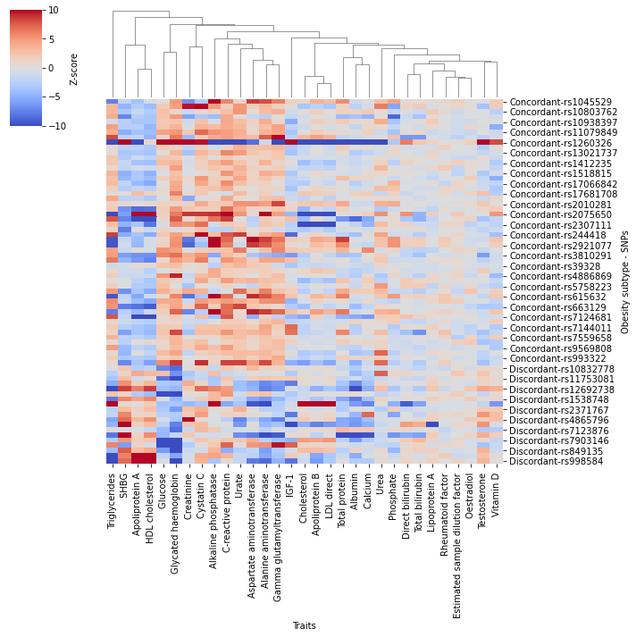

# project-work-2021-danielcoral
project-work-2021-danielcoral created by GitHub Classroom

# COMPUTE Project - Discordant variant analysis

Obesity is closely linked to T2D, but this relationship is highly heterogeneous. Some individuals with obesity do not have the expected increase in T2D risk. In the contrary, some individuals develop T2D despite being consistently lean. In this project we will identify biomarkers that may be different between two genetically determined obesity profiles: one that also increases T2D risk (concordant) vs. one that decreases T2D risk (discordant). This may point to mechanisms uncoupling obesity from its cardiometabolic risk and may aid in early diagnosis and better stratification and interventions in obesity.

